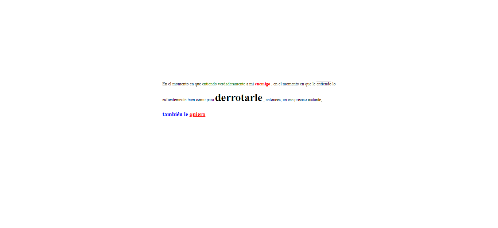
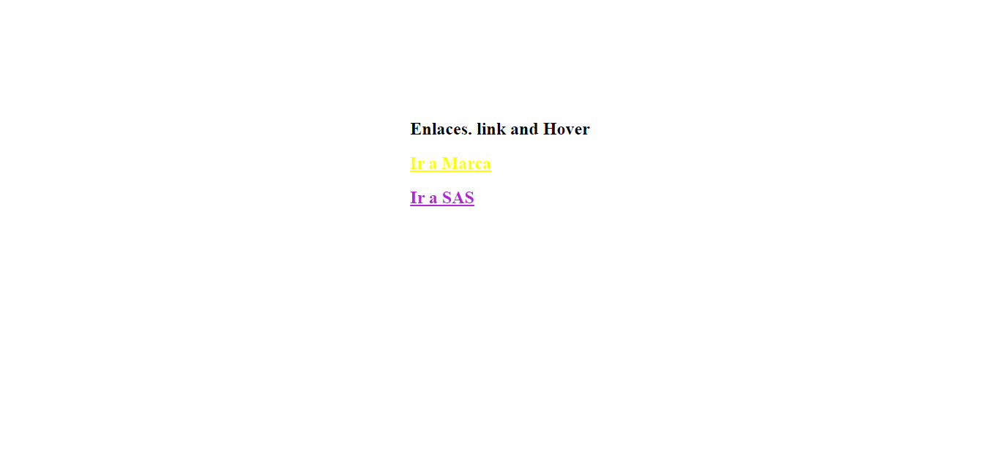
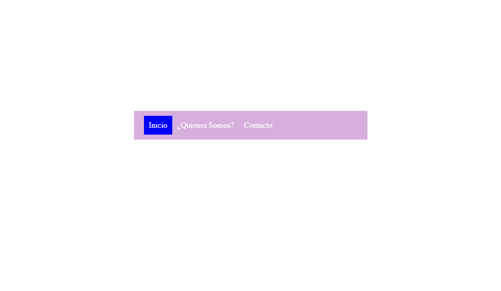
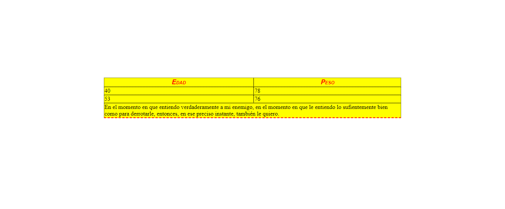

<h1>Taller 5 Johann Alberto Tocora Rodriguez</>

<h2>Información</h2>

Curso Full Stack Intermedio - Grupo 1

Profesor: Andres Pineda 

<h2>Punto 1 - 3 : Link de Figma</h2>
<a href="https://www.figma.com/file/xbpUpAfD8b6tO7ClDKRb6d/FullStack-Intermedio?type=design&node-id=2%3A2&mode=design&t=edj4T14b4PlJAfEO-1">Link de Figma</a>
 
<a href="https://jtocorarod.github.io/taller-5-full-stack-intermedio/">Link Página Web </a>

<h2>Punto 4 </h2>

<h2>Punto 5 </h2>

<h2>Punto 6 </h2>

<h2>Punto 7-8 </h2>

<h2>Punto 9 </h2>

